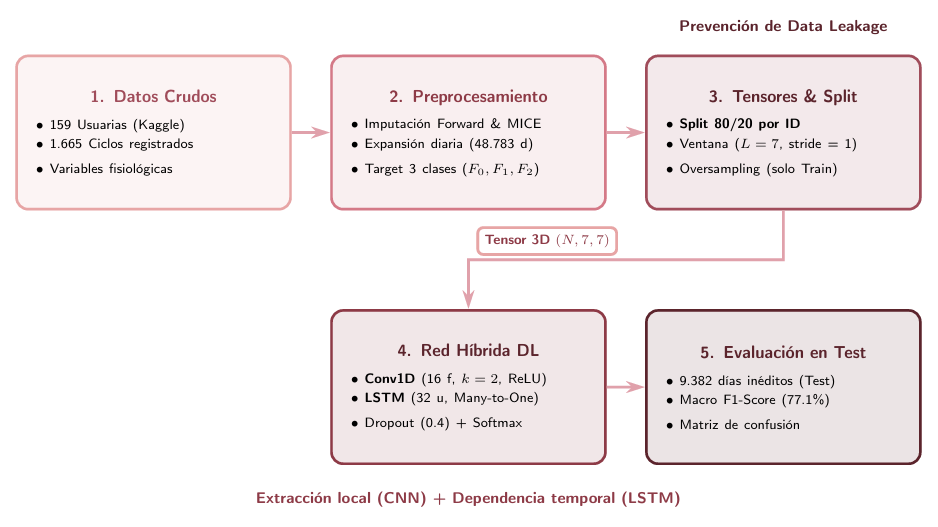
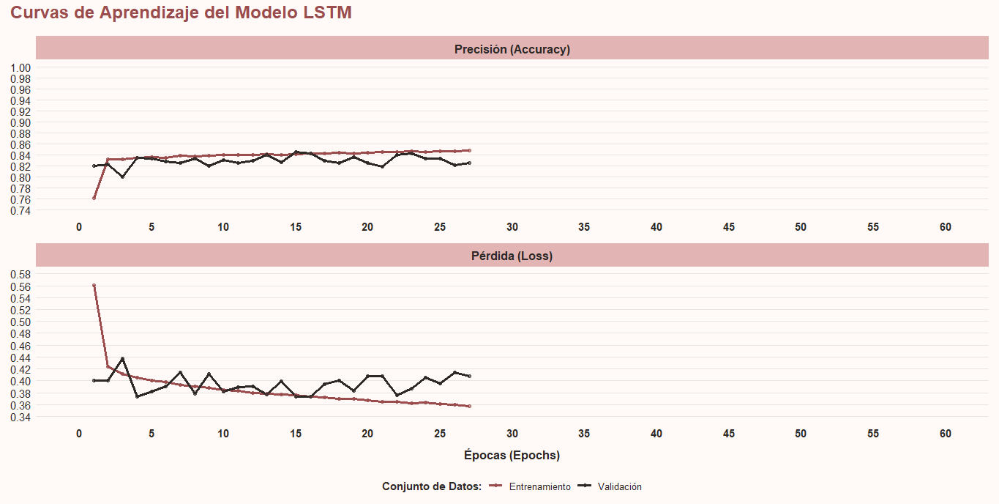

# Ciclo menstrual: Clasificación de las fases mediante Deep Learning

::: {style="font-size: 0.6em; color: #2D2926; margin-bottom: 30px; letter-spacing: 2px; text-align: center;"}
MODELOS DE DEEP LEARNING
:::

::::: columns
::: {.column width="50%" style="text-align: center;"}
**Integrantes:** <br> Sofía Roca Contreras <br> Bianca Bruna Ramírez
:::

::: {.column width="50%" style="text-align: center;"}
**Profesor:** <br> Francisco Plaza-Vega
:::
:::::

::: {style="margin-top: 40px; font-size: 0.55em; color: #9B4D4D; text-align: center;"}
Universidad de Santiago de Chile
:::

## Objetivos {.smaller}

**Objetivo general:** Desarrollar y evaluar un modelo secuencial para clasificar las fases del ciclo menstrual en usuarias con patrones regulares e irregulares.

**Objetivos específicos:**

- Definir y construir las secuencia temporales y sus respectivas etiquetas.

- Implementar modelos LSTM y CNN 1D para la clasifación de las fases del ciclo menstrual.

- Comparar su desempeño con un modelo tradicional mediante F1-Score y métricas por fase.

## Descripción de los datos {.smaller}

**Base de datos** de 80 variables y 1.665 observaciones extraída de [Kaggle](https://www.kaggle.com/datasets/nikitabisht/menstrual-cycle-data)

Registros de ciclos menstruales de 159 personas.

::: {style="font-size: 52%;"}
| Variables | Descripción | Tipo |
|:----------------------:|:----------------------:|:----------------------:|
| id | Identificador único de la usuaria | Texto |
| numero_ciclo | Número secuencial del ciclo registrado para esa usuaria | Entero |
| edad | Edad de la usuaria | Entero |
| imc | Índice de Masa Corporal (IMC) | Decimal |
| duracion_ciclo | Duración total del ciclo en días. | Entero |
| promedio_duracion_ciclo | Promedio de duración de los ciclos de la usuaria | Entero |
| duracion_menstruacion | Duración del periodo menstrual (días de sangrado) | Entero |
| promedio_duracion_menstruacion | Promedio de duración de la menstruación | Decimal |
| intensidad_sangrado_media | Intensidad promedio de sangrado | Decimal |
| primer_dia_alta_fertilidad | Primer día de niveles "altos" de fertilidad detectados | Entero |
| total_dias_alta_fertilidad | Cantidad total de días con fertilidad alta | Entero |
| total_dias_peak_fertilidad | Cantidad de días en el nivel máximo (Peak) de fertilidad | Entero |
| dia_estimado_ovulacion | Día estimado de la ovulación dentro del ciclo | Entero |
| duracion_fase_lutea | Duración de la fase lútea (post-ovulación) | Entero |
:::

## Visualización {.smaller}

::: {style="font-size: 45%; overflow-x: auto;"}
```{r}
library(dplyr)
library(DT)
setwd("C:/Users/sofir/OneDrive/Escritorio/Universidad/Deep learning/Presentación 2")
data = read.csv("FedCycleData071012 (2).csv")

data = data %>%
  select(ClientID, CycleNumber, Age, BMI, LengthofCycle, MeanCycleLength, LengthofMenses,
         MeanMensesLength, MeanBleedingIntensity, FirstDayofHigh, TotalNumberofHighDays,
         TotalNumberofPeakDays, EstimatedDayofOvulation, LengthofLutealPhase) %>%
  rename(id                         = ClientID,
         numero_ciclo               = CycleNumber,
         edad                       = Age,
         imc                        = BMI,
         duracion_ciclo             = LengthofCycle,
         promedio_duracion_ciclo    = MeanCycleLength,
         duracion_menstruacion      = LengthofMenses,
         promedio_duracion_menstruacion   = MeanMensesLength,
         intensidad_sangrado_media  = MeanBleedingIntensity,
         primer_dia_alta_fertilidad            = FirstDayofHigh,
         total_dias_alta_fertilidad           = TotalNumberofHighDays,
         total_dias_peak_fertilidad            = TotalNumberofPeakDays,
         dia_estimado_ovulacion     = EstimatedDayofOvulation,
         duracion_fase_lutea        = LengthofLutealPhase)

datatable(data, options = list(
  scrollX = TRUE,
  columnDefs = list(list(className = 'dt-center', targets = "_all"))
))
```
:::

# Análisis exploratorio e imputación

## Tratamiento de valores faltantes {.smaller}

:::: panel-tabset
### Imputación

1.  Relleno secuencial (**Forward fill**) [@logapriya2024optimized]: edad, imc, promedio_duracion_ciclo, promedio_duracion_menstruacion, intensidad_sangrado_media.

2.  Imputación local (**Media y mediana historica**) [@khairunisa2025comparison]: promedio_duracion_ciclo (se recalcula con duracion_ciclo), promedio_duracion_menstruacion (se recalcula con duracion_menstruacion).

3.  Imputación global (**Media global**): intensidad_sangrado_media, duracion_menstruacion, duracion_ciclo, primer_dia_alta_fertilidad, total_dias_alta_fertilidad, total_dias_peak_fertilidad, dia_estimado_ovulacion, duracion_fase_lutea.

4.  Algoritmo Predictivo Multivariado (**MICE - Predictive Mean Matching**): edad, imc, intensidad_sangrado_media, promedio_duracion_menstruacion, promedio_duracion_ciclo.

### Resultado

::: {style="font-size: 45%; overflow-x: auto;"}
```{r}
#| eval: true
#| echo: false

library(tidyr)
library(mice)

setwd("C:/Users/sofir/OneDrive/Escritorio/Universidad/Deep learning/Presentación 2")
data = read.csv("FedCycleData071012 (2).csv")

df_filter = data %>%
  # Seleccionar variables de interés para el proyecto
  select(ClientID, CycleNumber, Age, BMI, LengthofCycle, MeanCycleLength, LengthofMenses,
         MeanMensesLength, MeanBleedingIntensity, FirstDayofHigh, TotalNumberofHighDays,
         TotalNumberofPeakDays, EstimatedDayofOvulation, LengthofLutealPhase) %>%
  
  # --- PRIMERA FASE: Agrupado por paciente ---
  group_by(ClientID) %>%
  # Relleno de valores faltantes hacia adelante
  fill(Age, BMI, MeanCycleLength, MeanMensesLength, MeanBleedingIntensity, .direction = "downup") %>%
  mutate(# En casos variables de "media", calcular manual
    MeanCycleLength = mean(LengthofCycle, na.rm = TRUE),
    MeanMensesLength = mean(LengthofMenses, na.rm = TRUE),
    # Imputación local (usando la mediana de la propia paciente)
    FirstDayofHigh = ifelse(is.na(FirstDayofHigh), median(FirstDayofHigh, na.rm = TRUE), FirstDayofHigh),
    TotalNumberofPeakDays = ifelse(is.na(TotalNumberofPeakDays), median(TotalNumberofPeakDays, na.rm = TRUE), TotalNumberofPeakDays),
    EstimatedDayofOvulation = ifelse(is.na(EstimatedDayofOvulation), median(EstimatedDayofOvulation, na.rm = TRUE), EstimatedDayofOvulation),
    LengthofLutealPhase = ifelse(is.na(LengthofLutealPhase), median(LengthofLutealPhase, na.rm = TRUE), LengthofLutealPhase),
    TotalNumberofHighDays = ifelse(is.na(TotalNumberofHighDays), median(TotalNumberofHighDays, na.rm = TRUE), TotalNumberofHighDays)) %>%
  # --- SEGUNDA FASE: Tratamiento global ---
  ungroup() %>%
  mutate(
    MeanBleedingIntensity   = ifelse(is.na(MeanBleedingIntensity), median(MeanBleedingIntensity, na.rm = TRUE), MeanBleedingIntensity),
    LengthofMenses          = ifelse(is.na(LengthofMenses), median(LengthofMenses, na.rm = TRUE), LengthofMenses),
    LengthofCycle           = ifelse(is.na(LengthofCycle), median(LengthofCycle, na.rm = TRUE), LengthofCycle),
    FirstDayofHigh          = ifelse(is.na(FirstDayofHigh), median(FirstDayofHigh, na.rm = TRUE), FirstDayofHigh),
    TotalNumberofHighDays   = ifelse(is.na(TotalNumberofHighDays), median(TotalNumberofHighDays, na.rm = TRUE), TotalNumberofHighDays),
    TotalNumberofPeakDays   = ifelse(is.na(TotalNumberofPeakDays), median(TotalNumberofPeakDays, na.rm = TRUE), TotalNumberofPeakDays),
    EstimatedDayofOvulation = ifelse(is.na(EstimatedDayofOvulation), median(EstimatedDayofOvulation, na.rm = TRUE), EstimatedDayofOvulation),
    LengthofLutealPhase     = ifelse(is.na(LengthofLutealPhase), median(LengthofLutealPhase, na.rm = TRUE), LengthofLutealPhase)
  )

df_pacientes = df_filter %>%
  group_by(ClientID) %>%
  summarise(
    Age = first(Age),
    BMI = first(BMI),
    MeanBleedingIntensity = first(MeanBleedingIntensity),
    # Le pasamos los promedios al algoritmo para que haga mejores predicciones
    MeanCycleLength = first(MeanCycleLength), 
    MeanMensesLength = first(MeanMensesLength)
  ) %>%
  ungroup()

datos_para_imputar = df_pacientes %>% select(-ClientID) # Quitamos el ID

# Aplicar la función "mice"
imputacion = mice(datos_para_imputar, m = 1, method = "pmm", seed = 123, printFlag = FALSE)
# datos_para_imputar: data frame que contiene valores faltantes que no lograron ser imputados por otros métodos
# m = 1: número de bases de datos imputadas múltiples que el algoritmo va a generar.
# method = "pmm": Define el método matemático de imputación. "pmm" significa Predictive Mean Matching (Emparejamiento de Medias Predictivas).
# seed = 123: Establece la semilla aleatoria.
# printFlag = FALSE: Controla los mensajes que aparecen en la pantalla.

# Extraemos la base de pacientes ya rellenada
pacientes_imputados = complete(imputacion)
# complete: Es una función propia del paquete mice. Su trabajo es "extraer" los datos. El objeto que crea mice() es muy complejo y contiene mucha meta-información sobre el proceso de imputación, pero complete() ignora todo eso y extrae únicamente la tabla final con los valores originales más los huecos (NA) ya rellenados.

# Devolvemos el ClientID a la tabla limpia
df_pacientes_limpio = bind_cols(ClientID = df_pacientes$ClientID, pacientes_imputados)

# 4. FASE 3: Reconstruir la base final uniendo los datos perfectos
df_final = df_filter %>%
  # Quitamos las columnas originales que aún tenían NA
  select(-Age, -BMI, -MeanBleedingIntensity) %>%
  # Pegamos las columnas corregidas asegurando que coincidan por ClientID
  left_join(df_pacientes_limpio %>% select(ClientID, Age, BMI, MeanBleedingIntensity), by = "ClientID")

df_final = df_final %>% 
  rename(id                         = ClientID,
         numero_ciclo               = CycleNumber,
         edad                       = Age,
         imc                        = BMI,
         duracion_ciclo             = LengthofCycle,
         promedio_duracion_ciclo    = MeanCycleLength,
         duracion_menstruacion      = LengthofMenses,
         promedio_duracion_menstruacion   = MeanMensesLength,
         intensidad_sangrado_media  = MeanBleedingIntensity,
         primer_dia_alta_fertilidad            = FirstDayofHigh,
         total_dias_alta_fertilidad           = TotalNumberofHighDays,
         total_dias_peak_fertilidad            = TotalNumberofPeakDays,
         dia_estimado_ovulacion     = EstimatedDayofOvulation,
         duracion_fase_lutea        = LengthofLutealPhase)

datatable(df_final, options = list(
  scrollX = TRUE,
  columnDefs = list(list(className = 'dt-center', targets = "_all"))
))
```
:::
::::

## Análisis exploratorio {.smaller}

Tranformar a base de datos diaria e identificar a que ciclo pertenece cada registro diario.

::: {style="font-size: 45%; overflow-x: auto;"}
```{r}
# Transformar el df a diario y definir target
df_diario = df_final %>%
  # Limpieza de seguridad: evitamos que un ciclo sin duración rompa el código
  filter(!is.na(duracion_ciclo) & duracion_ciclo > 0) %>%
  
  # 1. Expandir cada fila de ciclo en N filas (una por cada día del ciclo)
  uncount(duracion_ciclo, .remove = FALSE, .id = "dia_ciclo") %>%
  
  # 2. Creación de la Variable Objetivo Multiclase a nivel DIARIO
  mutate(
    etapa_target = case_when(
      # Clase 0: Días previos a la ovulación (Menstrual + Folicular)
      dia_ciclo < (dia_estimado_ovulacion - 1) ~ 0,
      
      # Clase 1: Ventana Ovulatoria (Día de ovulación y sus márgenes inmediatos)
      dia_ciclo >= (dia_estimado_ovulacion - 1) & dia_ciclo <= (dia_estimado_ovulacion + 1) ~ 1,
      
      # Clase 2: Fase Lútea (Días posteriores a la ovulación hasta el fin del ciclo)
      dia_ciclo > (dia_estimado_ovulacion + 1) ~ 2,
      
      # Por seguridad ante NAs u otros problemas
      TRUE ~ 0 
    )
  )

datatable(df_diario, options = list(
  scrollX = TRUE,
  columnDefs = list(list(className = 'dt-center', targets = "_all"))
))
```
:::

## Análisis exploratorio {.smaller}

```{r}

# Transformar el df a diario y definir target
df_diario = df_final %>%
  # Limpieza de seguridad: evitamos que un ciclo sin duración rompa el código
  filter(!is.na(duracion_ciclo) & duracion_ciclo > 0) %>%
  
  # 1. Expandir cada fila de ciclo en N filas (una por cada día del ciclo)
  uncount(duracion_ciclo, .remove = FALSE, .id = "dia_ciclo") %>%
  
  # 2. Creación de la Variable Objetivo Multiclase a nivel DIARIO
  mutate(
    etapa_target = case_when(
      # Clase 0: Días previos a la ovulación (Menstrual + Folicular)
      dia_ciclo < (dia_estimado_ovulacion - 1) ~ 0,
      
      # Clase 1: Ventana Ovulatoria (Día de ovulación y sus márgenes inmediatos)
      dia_ciclo >= (dia_estimado_ovulacion - 1) & dia_ciclo <= (dia_estimado_ovulacion + 1) ~ 1,
      
      # Clase 2: Fase Lútea (Días posteriores a la ovulación hasta el fin del ciclo)
      dia_ciclo > (dia_estimado_ovulacion + 1) ~ 2,
      
      # Por seguridad ante NAs u otros problemas
      TRUE ~ 0 
    )
  )

# 1. Cargar librerías necesarias
library(tidyverse)

# (OPCIONAL) Si quieres usar las fuentes exactas de tu archivo SCSS en el gráfico:
# install.packages("showtext")
# library(showtext)
# font_add_google("Playfair Display", "playfair")
# font_add_google("Montserrat", "montserrat")
# showtext_auto()
# Si usas esto, cambia base_family = "sans" por base_family = "montserrat" en el theme_minimal() abajo.

# 2. Crear el dataframe resumen
df_resumen_clases <- df_diario %>%
  mutate(nombre_clase = case_when(
    etapa_target == 0 ~ "Clase 0:\nMenstrual/Folicular",
    etapa_target == 1 ~ "Clase 1:\nVentana Ovulatoria",
    etapa_target == 2 ~ "Clase 2:\nFase Lútea"
  )) %>%
  # Esto asegura que el orden en el gráfico sea 0, 1, 2 (y no alfabético)
  mutate(nombre_clase = factor(nombre_clase, levels = c(
    "Clase 0:\nMenstrual/Folicular", 
    "Clase 1:\nVentana Ovulatoria", 
    "Clase 2:\nFase Lútea"
  ))) %>%
  group_by(nombre_clase) %>%
  summarise(cantidad = n()) %>%
  mutate(porcentaje = round(cantidad / sum(cantidad) * 100, 1))

# 3. Generar el gráfico con tu estética SCSS
grafico_desbalance <- ggplot(df_resumen_clases, aes(x = nombre_clase, y = cantidad, fill = nombre_clase)) +
  # Barras un poco más delgadas para mayor elegancia
  geom_col(width = 0.6, show.legend = FALSE, alpha = 0.95) +
  
  # Textos sobre las barras con tu color $body-color
  geom_text(aes(label = paste0(cantidad, " días\n(", porcentaje, "%)")), 
            vjust = -0.5, size = 5, color = "#2D2926", fontface = "bold") +
  
  # Aplicación estratégica de tu paleta:
  # Mayorías = Suaves ($selection-bg), Minoría crítica = Fuerte ($heading-color)
  scale_fill_manual(values = c(
    "Clase 0:\nMenstrual/Folicular" = "#E2B4B4", 
    "Clase 1:\nVentana Ovulatoria"  = "#9B4D4D",  # ¡Color principal para destacar el desbalance!
    "Clase 2:\nFase Lútea"          = "#D5A5A5"   # Tono intermedio
  )) +
  
  # Dar espacio arriba para que no se corte el texto
  scale_y_continuous(expand = expansion(mult = c(0, 0.25))) +
  
  labs(
    title = "Desbalance de Clases",
    subtitle = "Distribución del total de días registrados según la fase del ciclo",
    x = NULL, # Ocultamos la etiqueta X para que sea más limpio
    y = "Número Total de Días"
  ) +
  # Tema personalizado basado en tu archivo SCSS
  theme_minimal(base_family = "sans") + 
  theme(
    # Aplicar el color de fondo crema de tu SCSS ($body-bg)
    plot.background = element_rect(fill = "#FFF9F8", color = NA),  
    panel.background = element_rect(fill = "#FFF9F8", color = NA),
    
    # Títulos con el color principal ($heading-color)
    plot.title = element_text(color = "#9B4D4D", face = "bold", size = 20, margin = margin(b = 10)), 
    plot.subtitle = element_text(color = "#2D2926", size = 14, margin = margin(b = 20)),
    plot.caption = element_text(color = "#9B4D4D", face = "italic", size = 10, margin = margin(t = 15)),
    
    # Ejes con el color de texto ($body-color)
    axis.title.y = element_text(color = "#2D2926", face = "bold", size = 12, margin = margin(r = 10)),
    axis.text.x = element_text(color = "#2D2926", size = 13, face = "bold"),
    axis.text.y = element_text(color = "#2D2926", size = 11),
    
    # Limpiar líneas de la cuadrícula para un look moderno
    panel.grid.major.x = element_blank(), 
    panel.grid.minor = element_blank(),
    
    # SOLUCIÓN AQUÍ: Usamos la función alpha() de ggplot2 para el 10% de opacidad
    panel.grid.major.y = element_line(color = alpha("#2D2926", 0.1))
  )
  

# Mostrar el gráfico
print(grafico_desbalance)
```

## Análisis exploratorio {.smaller}

```{r}
# --- GRÁFICO 2: Dinámica temporal y la Ventana de Contexto (LSTM) ---
library(ggplot2)
library(dplyr)

# 1. Asegurarnos de usar 'df_filter' (que sabemos que TIENE ClientID)
# y cruzarlo con tu lógica diaria solo para este paciente de ejemplo
ejemplo_id <- unique(df_filter$ClientID)[1] 

# Reconstruimos la serie temporal solo para el paciente de ejemplo
ejemplo_ciclo <- df_filter %>%
  filter(ClientID == ejemplo_id, CycleNumber == 1) %>%
  # Expandimos a días
  rowwise() %>%
  do(data.frame(
    dia_ciclo = 1:.$LengthofCycle,
    dia_estimado_ovulacion = .$EstimatedDayofOvulation,
    LengthofCycle = .$LengthofCycle
  )) %>%
  ungroup() %>%
  mutate(
    # Recreamos el target
    etapa_target = case_when(
      dia_ciclo < (dia_estimado_ovulacion - 1) ~ 0,
      dia_ciclo >= (dia_estimado_ovulacion - 1) & dia_ciclo <= (dia_estimado_ovulacion + 1) ~ 1,
      dia_ciclo > (dia_estimado_ovulacion + 1) ~ 2,
      TRUE ~ 0
    ),
    # Etiquetas para la leyenda
    Fase = case_when(
      etapa_target == 0 ~ "Folicular / Menstrual",
      etapa_target == 1 ~ "Ventana Ovulatoria",
      etapa_target == 2 ~ "Fase Lútea"
    ),
    Fase = factor(Fase, levels = c("Folicular / Menstrual", "Ventana Ovulatoria", "Fase Lútea"))
  )

# Calculamos dónde va la ventana de L=7
LONGITUD_VENTANA <- 7
dia_fin_ventana <- max(ejemplo_ciclo$dia_ciclo[ejemplo_ciclo$etapa_target == 0], na.rm = TRUE)
dia_inicio_ventana <- dia_fin_ventana - LONGITUD_VENTANA + 1

# Generamos el gráfico con la estética SCSS
grafico_evolucion <- ggplot(ejemplo_ciclo, aes(x = dia_ciclo, y = 1, fill = Fase)) +
  geom_tile(color = "white", linewidth = 1, height = 0.5) +
  
  # 1. Ajuste de paleta al estilo SCSS
  scale_fill_manual(values = c(
    "Folicular / Menstrual" = "#E2B4B4",  
    "Ventana Ovulatoria"  = "#9B4D4D",  # Color principal destacado
    "Fase Lútea"          = "#D5A5A5"   # Tono intermedio
  )) +
  scale_x_continuous(breaks = seq(1, max(ejemplo_ciclo$LengthofCycle), by = 1)) +
  
  # 2. Ajuste de anotaciones (Cambiamos el rojo puro por el color de texto del theme)
  annotate("rect", 
           xmin = dia_inicio_ventana - 0.5, 
           xmax = dia_fin_ventana + 0.5, 
           ymin = 0.65, ymax = 1.35,
           color = "#2D2926", fill = NA, linewidth = 1.2, linetype = "dashed") +
  annotate("text", x = dia_inicio_ventana + (LONGITUD_VENTANA/2) - 0.5, y = 1.45, 
           label = paste("Ventana de Contexto (L =", LONGITUD_VENTANA, ")"), 
           color = "#2D2926", fontface = "bold") +
  
  labs(
    title = paste(" Ciclo y Ventana Deslizante (Paciente:", ejemplo_id, ")"),
    x = "Día del Ciclo",
    y = NULL,
    fill = "Clase Objetivo (Target)"
  ) +
  
  # 3. Aplicación del tema personalizado SCSS
  theme_minimal(base_family = "sans") + 
  theme(
    # Aplicar el color de fondo crema ($body-bg)
    plot.background = element_rect(fill = "#FFF9F8", color = NA),  
    panel.background = element_rect(fill = "#FFF9F8", color = NA),
    
    # Títulos con el color principal ($heading-color)
    plot.title = element_text(color = "#9B4D4D", face = "bold", size = 18, margin = margin(b = 10)), 
    plot.subtitle = element_text(color = "#2D2926", size = 13, margin = margin(b = 20)),
    
    # Ejes con el color de texto ($body-color)
    axis.title.x = element_text(color = "#2D2926", face = "bold", size = 12, margin = margin(t = 10)),
    axis.text.x = element_text(color = "#2D2926", size = 11, face = "bold"),
    
    # Ocultar eje Y como en tu código original
    axis.text.y = element_blank(),
    axis.ticks.y = element_blank(),
    axis.title.y = element_blank(),
    
    # Leyenda adaptada al theme
    legend.position = "bottom",
    legend.title = element_text(color = "#2D2926", face = "bold", size = 11),
    legend.text = element_text(color = "#2D2926", size = 10),
    legend.background = element_rect(fill = "#FFF9F8", color = NA),
    
    # Limpieza de cuadrículas
    panel.grid.major.y = element_blank(), 
    panel.grid.minor = element_blank(),
    panel.grid.major.x = element_line(color = alpha("#2D2926", 0.1))
  )

print(grafico_evolucion)
```

# Metodología e implementación

## Metodología {.smaller}

{#fig-etiqueta fig-align="center"}

## Red híbrida CNN-1D y LSTM {.smaller}

1. Capa CNN-1D 16 filtros (kernel = 2): Extrae patrones locales y transiciones de corto plazo entre días adyacentes a la ventana tempora.

2. Capa LSTM 32 unidades (many-to-one): Captura la dependencia secuencial a lo largo de los 7 días de contexto histórico para la clasificación diaria.

3. Regularización Dropout (40%) + Dense: Capa de Dropout al 0.4 para mitigar el sobreajuste del oversampling, seguida de capas Densas y activación Softmax (3 clases).

```{r}
#| eval: false
#| echo: true

model = keras_model_sequential(
  layers = list(
    keras_input(shape = c(LONGITUD_VENTANA, train_data$num_features)),
    layer_conv_1d(filters = 16, kernel_size = 2, activation = "relu", padding = "same"),
    layer_lstm(units = 32, return_sequences = FALSE),
    layer_dropout(rate = 0.4),
    layer_dense(units = 16, activation = "relu"),
    layer_dense(units = 3, activation = "softmax")
  )
)
```

## Entrenamiento de la red {.smaller}

| Parámetro              | Configuración              |
|:-----------------------|:---------------------------|
| **Partición**          | 80% Train / 20% Test       |
| **Optimizador**        | **Adam** ($\eta = 0.0005$) |
| **Función de Pérdida** | *Categorical Crossentropy* |
| **Tamaño de Lote**     | 32 muestras (*Batch Size*) |
| **Épocas Máximas**     | 60 épocas                  |
| **Plataforma**         | TensorFlow / Keras 3       |
| **Hardware**           | CPU estándar               |
| **Tiempo de cómputo**  | 1-2 min. Aprox.            |

## Entrenamiento de la red {.smaller}

{#fig-etiqueta fig-align="center"}

# Validación, resultados y comparación

## Validación de resultados {.smaller}

**Desempeño Real en Test (9.382 muestras inéditas)**

* **Accuracy Global:** 84,02% | **Loss:** 0,3760

| Fase Biológica (Clase) | Precision | Recall | F1-Score |
| :--- | :---: | :---: | :---: |
| **F0: Folicular/Menstrual** (0) | 96,73% | 86,45% | **91,30%** |
| **F1: Ventana Ovulatoria** (1) | 37,38% | 78,95% | **50,74%** |
| **F2: Fase Lútea** (2) | 96,87% | 82,62% | **89,18%** |
| **Promedio Global (Macro)** | 76,99% | 82,67% | **77,07%** |

## Validación de resultados {.smaller}

**Matriz de Confusión Multiclase**

| Predicción \ Real | F0 (Folicular) | F1 (Ovulatoria) | F2 (Lútea) | Total |
| :--- | :---: | :---: | :---: | :---: |
| **F0 (Folicular)** | <span style="color:#2e7d32; font-weight:bold; background-color:#e8f5e9; padding:2px 6px; border-radius:4px;">3.753</span> | 112 | 15 | **3.880** |
| **F1 (Ovulatoria)** | 568 | <span style="color:#d84315; font-weight:bold; background-color:#fbe9e7; padding:2px 6px; border-radius:4px;">754</span> | 695 | **2.017** |
| **F2 (Lútea)** | 20 | 89 | <span style="color:#2e7d32; font-weight:bold; background-color:#e8f5e9; padding:2px 6px; border-radius:4px;">3.376</span> | **3.485** |
| **Total Real** | **4.341** | **955** | **4.086** | **9.382** |

## Comparación de Resultados y Estado del Arte {.smaller}

Al evaluar el desempeño, contrastamos nuestra arquitectura con métodos tradicionales y literatura reciente. Dado el desbalance fisiológico, la métrica de decisión principal es el **Macro F1-Score**.

::: {style="font-size: 45%;"}
| Modelo / Enfoque | Tipo | Accuracy Global | F1 Folicular (F0) | F1 Ovulatoria (F1) | F1 Lútea (F2) | Macro F1-Score |
| :--- | :--- | :---: | :---: | :---: | :---: | :---: |
| **Calendario Estático (Regla 28 días)** | Regla Fija | 64.2% | 72.1% | 28.5% | 68.0% | **56.2%** |
| **Random Forest (Nuestro Baseline)** | Tradicional | **87.2%** | 92.0% | 37.1% | **92.1%** | **73.7%** |
| **Desak et al. (2025) - Decision Tree** | Literatura | 85.2% | - | - | - | **-** |
| **Nuestra Red Híbrida (CNN 1D + LSTM)** | **Propuesto** | 84.0% | **91.3%** | **50.7%** | 89.2% | **77.1%** |
:::

# Conclusiones, limitaciones y trabajos futuros {.smaller}

## Conclusiones {.smaller}

* **Objetivos Cumplidos:** Se logró desarrollar e implementar exitosamente una arquitectura secuencial (CNN-1D + LSTM) capaz de procesar historiales menstruales diarios.

* **Superación del Estado del Arte:** Se demostró que los modelos tradicionales (Random Forest) caen en la "Trampa de la Exactitud", fallando en detectar la ventana ovulatoria (F1 de 37.1%). Nuestra red híbrida aprendió la dependencia temporal, elevando drásticamente esta detección (F1 de 50.7%) y logrando el mejor Macro F1-Score global (77.1%).

* **Valor Clínico:** El uso de Deep Learning permite predecir fases críticas sin depender de calendarios rígidos, adaptándose a la variabilidad biológica real de mujeres con ciclos irregulares.

## Limitaciones y trabajo futuro {.smaller}

### Limitaciones del Dataset

* **Falta de Biomarcadores Diarios Clave:** La base actual no cuenta con registros continuos de Temperatura Basal (BBT) ni niveles hormonales (LH/FSH), los cuales son fisiológicamente determinantes para anclar el día exacto de la ovulación.

* **Naturaleza Autorreportada:** Los datos provienen de registros manuales, lo que introduce ruido y subjetividad humana en variables como "intensidad del sangrado".

### Trabajo Futuro

* Integrar datos continuos provenientes de dispositivos wearables (relojes inteligentes, anillos) que midan variabilidad de la frecuencia cardíaca (HRV) y temperatura de la piel durante el sueño.

* Probar mecanismos de Atención (Transformers) para que la red pondere automáticamente qué ciclos históricos son más relevantes para predecir el ciclo actual.

# Referencias {.smaller}

<div style="font-size: 0.6em; line-height: 1.2;">
::: {#refs}
:::
</div>

